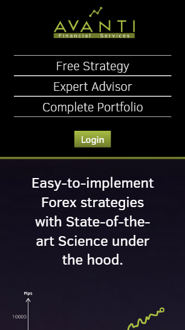

# avantiweb
Avanti Servicios Financieros, C.A. website (Django/Javascript/PostgreSQL)

The core functionality of this web app is a learning center, where the administrator can upload content as text, videos and files. Each content location is stored in the "course" app model. Each content is displayed in a Module, and each module belongs to a Course. The app renders the Courses and Modules the learner has enrolled to. The enrollment must be done by paying the course.

<h4>Front p

<h5>Responsibe front p

